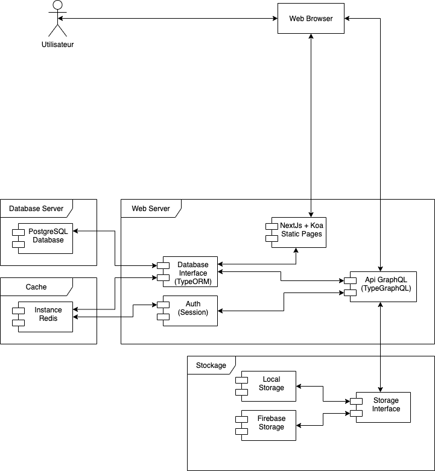
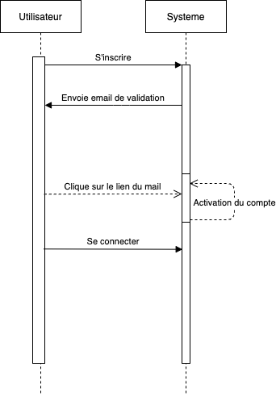

# Application de partage de ses photos de voyage(s).

Un système de validation du compte par l’envoi d’un email avec un lien à cliquer sera effectuélors de l’inscription d’un utilisateur.

Une fois inscrit, on pourra créer des voyages dans notre espace.

Pour chaque voyage, on pourra uploader une collection de photos.

Ensuite, cette collection ne sera pas publique par défaut. On pourra la rendre publique, ou bien enregistrer des adresses email à qui on enverra un lien d’accès à la galerie protégée.

Pour chaque photo, on pourra générer des miniatures pour l’affichage en liste.

Également, on aura la possibilité d’envoyer les images sur un espace de stockage externe, comme S3 par exemple. L’implémentation n’est pas obligatoire, mais doit pouvoir être intégrée à l’application de manière simple.

On pourra aussi ajouter une carte dans l’interface, pour chaque voyage.

En effet, une évolution de ce projet pourrait être d’associer un voyage à plusieurs destinations, qui apparaîtraient alors sur une carte.

Pour chaque destination, on pourrait associer des dates de visite(arrivée / départ), ainsi que plusieurs images venant illustrer la destination.

Une destination correspondrait à une ville, située dans un pays.On pourrait alors définir des voyages traversant plusieurs pays.

Enfin, une autre évolution du projet serait l’ajout d’un système de«likes»etcommentaires sur un voyage(ou une destination, ou une image), par d’autres utilisateurs enregistrés.

# Technos

- Tailwindcss
- NextJs
  - Koa
  - TypeORM
- GraphQL
  - Type-GraphQL
  - Apollo Server

# Use Case

# Diagramme Class

On peut mettre un J'aime et un COmmentaire sur tous les éléments

# Diagramme de class storage

Possibilité d'utiliser plusieurs strategies dans le meme server, par exemple les photo des albums dans firebase, les photos des destinations dans s3 et des photos de profils dans le local

# Diagramme de déploiement

# Base de données

# Diagramme de séquence

Un utilisateur s'inscrit, recoit un email avec un lien d'activation, le compte est valide l'utilisateur peut donc se connecter

